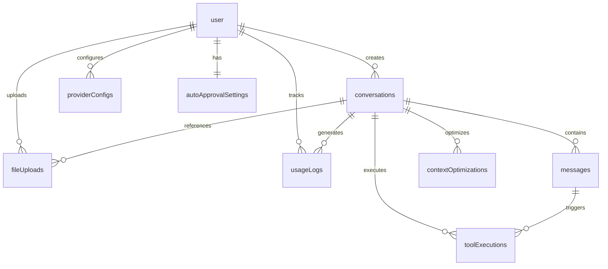

# Database Schema Documentation

## 🗄️ Overview

BestChatApp uses PostgreSQL with Drizzle ORM for robust, type-safe database operations. The schema is designed following Cline's proven patterns for scalability, performance, and maintainability.

## 🏗️ Schema Architecture

### Design Principles

- **UUID Primary Keys**: Distributed scalability and avoiding sequence conflicts
- **JSONB Flexibility**: Store complex metadata and configuration data efficiently  
- **Comprehensive Indexing**: Query optimization for high-performance operations
- **Cascading Deletes**: Maintain referential integrity and prevent orphaned data
- **Audit Trails**: Track creation and modification timestamps throughout

### Core Schema Modules

#### 1. **Authentication Schema** (`auth.ts`)
Handles user authentication, sessions, and account management.

#### 2. **Subscriptions Schema** (`subscriptions.ts`) 
Manages user subscriptions and billing integration with Polar.

#### 3. **Chat Schema** (`chat.ts`) ⭐ *New in Sprint 00*
Comprehensive chat functionality with advanced features inspired by Cline.

## 📊 Chat Schema Tables

### Core Chat Tables

#### `conversations`
Central table for chat sessions and their configuration.

```sql
CREATE TABLE conversations (
  id                     UUID PRIMARY KEY DEFAULT gen_random_uuid(),
  user_id                TEXT NOT NULL REFERENCES user(id) CASCADE,
  title                  VARCHAR(500),
  provider               VARCHAR(50) NOT NULL,      -- anthropic, openai, etc.
  model                  VARCHAR(100) NOT NULL,
  system_prompt          TEXT,
  context_window_size    INTEGER DEFAULT 8192,
  auto_approval_settings JSONB DEFAULT '{}',
  metadata              JSONB DEFAULT '{}',
  created_at            TIMESTAMP DEFAULT now(),
  updated_at            TIMESTAMP DEFAULT now()
);
```

**Key Features:**
- Multi-provider support (20+ LLM providers)
- Flexible system prompts per conversation
- Per-conversation auto-approval settings
- Extensible metadata storage

**Indexes:**
- `idx_conversations_user_id` - Fast user conversation lookup
- `idx_conversations_created_at` - Chronological ordering

#### `messages` 
Rich message storage with multimedia support.

```sql
CREATE TABLE messages (
  id                   UUID PRIMARY KEY DEFAULT gen_random_uuid(),
  conversation_id      UUID NOT NULL REFERENCES conversations(id) CASCADE,
  role                 VARCHAR(20) NOT NULL,    -- user, assistant, system
  content              TEXT NOT NULL,
  images               JSONB DEFAULT '[]',      -- Image URLs/data array
  files                JSONB DEFAULT '[]',      -- File references array
  token_count          INTEGER,
  provider_metadata    JSONB DEFAULT '{}',      -- Provider-specific data
  created_at           TIMESTAMP DEFAULT now()
);
```

**Key Features:**
- Rich content support (text, images, files)
- Token tracking for usage analytics
- Provider-specific metadata storage
- Role-based message organization

**Indexes:**
- `idx_messages_conversation_id` - Fast conversation message lookup
- `idx_messages_created_at` - Chronological ordering
- `idx_messages_conversation_created` - Combined conversation + time queries

### Advanced Features Tables

#### `toolExecutions`
Detailed tool calling and execution tracking.

```sql
CREATE TABLE tool_executions (
  id                      UUID PRIMARY KEY DEFAULT gen_random_uuid(),
  message_id              UUID NOT NULL REFERENCES messages(id) CASCADE,
  conversation_id         UUID NOT NULL REFERENCES conversations(id) CASCADE,
  tool_name               VARCHAR(100) NOT NULL,
  parameters              JSONB NOT NULL,
  result                  JSONB,
  status                  VARCHAR(20) NOT NULL DEFAULT 'pending',
  approval_requested_at   TIMESTAMP,
  approved_at            TIMESTAMP,
  executed_at            TIMESTAMP,
  completed_at           TIMESTAMP,
  execution_time_ms      INTEGER,
  cost                   DECIMAL(10,4),
  error_message          TEXT,
  created_at             TIMESTAMP DEFAULT now()
);
```

**Status Workflow:**
1. `pending` → Tool call detected
2. `approved` → User/auto approval granted  
3. `executing` → Tool execution in progress
4. `completed` → Successfully executed
5. `failed` → Execution failed
6. `cancelled` → User cancelled

**Key Features:**
- Complete execution lifecycle tracking
- Cost tracking per tool execution
- Detailed timing metrics
- Error logging and debugging

**Indexes:**
- `idx_tool_executions_conversation_id` - Conversation tool history
- `idx_tool_executions_status` - Status-based queries
- `idx_tool_executions_tool_name` - Tool-specific analytics
- `idx_tool_executions_status_created` - Status timeline queries

#### `contextOptimizations`
Context management and optimization tracking.

```sql
CREATE TABLE context_optimizations (
  id                   UUID PRIMARY KEY DEFAULT gen_random_uuid(),
  conversation_id      UUID NOT NULL REFERENCES conversations(id) CASCADE,
  trigger_reason       VARCHAR(50) NOT NULL,    -- token_limit, user_request, auto
  optimization_type    VARCHAR(50) NOT NULL,    -- truncation, summarization, compression  
  tokens_before        INTEGER NOT NULL,
  tokens_after         INTEGER NOT NULL,
  summary              TEXT,
  affected_messages    JSONB,                   -- Array of message IDs
  created_at           TIMESTAMP DEFAULT now()
);
```

**Optimization Strategies:**
- **Truncation**: Remove old conversation parts
- **Summarization**: AI-generated conversation summaries
- **Compression**: Reduce repeated patterns and content

**Key Features:**
- Track context optimization history
- Measure token reduction effectiveness
- Preserve optimization summaries
- Audit affected messages

#### `fileUploads`
File reference and metadata management.

```sql
CREATE TABLE file_uploads (
  id              UUID PRIMARY KEY DEFAULT gen_random_uuid(),
  user_id         TEXT NOT NULL REFERENCES user(id) CASCADE,
  conversation_id UUID REFERENCES conversations(id) CASCADE,
  filename        VARCHAR(255) NOT NULL,
  original_name   VARCHAR(255) NOT NULL,
  mime_type       VARCHAR(100),
  file_size       INTEGER NOT NULL,
  storage_path    VARCHAR(500) NOT NULL,
  content_hash    VARCHAR(64),              -- Deduplication
  metadata        JSONB DEFAULT '{}',
  created_at      TIMESTAMP DEFAULT now()
);
```

**Key Features:**
- File deduplication via content hashing
- Comprehensive metadata storage
- User and conversation association
- Storage path abstraction

### Configuration & Tracking Tables

#### `providerConfigs`
Per-user LLM provider configurations.

```sql
CREATE TABLE provider_configs (
  id          UUID PRIMARY KEY DEFAULT gen_random_uuid(),
  user_id     TEXT NOT NULL REFERENCES user(id) CASCADE,
  provider    VARCHAR(50) NOT NULL,
  config      JSONB NOT NULL,           -- Encrypted API keys, settings
  is_active   BOOLEAN DEFAULT true,
  is_default  BOOLEAN DEFAULT false,
  created_at  TIMESTAMP DEFAULT now(),
  updated_at  TIMESTAMP DEFAULT now(),
  
  UNIQUE(user_id, provider)
);
```

**Key Features:**
- Encrypted API key storage
- Multiple provider configurations per user
- Active/inactive provider management
- Default provider selection

#### `usageLogs`
Token usage and cost tracking.

```sql
CREATE TABLE usage_logs (
  id              UUID PRIMARY KEY DEFAULT gen_random_uuid(),
  user_id         TEXT NOT NULL REFERENCES user(id) CASCADE,
  conversation_id UUID REFERENCES conversations(id) CASCADE,
  provider        VARCHAR(50) NOT NULL,
  model           VARCHAR(100) NOT NULL,
  input_tokens    INTEGER NOT NULL DEFAULT 0,
  output_tokens   INTEGER NOT NULL DEFAULT 0,
  cost           DECIMAL(10,4),
  created_at     TIMESTAMP DEFAULT now()
);
```

**Key Features:**
- Granular token tracking (input/output)
- Cost calculation and tracking
- Provider and model analytics
- User usage patterns

#### `autoApprovalSettings`
User preferences for tool auto-approval.

```sql
CREATE TABLE auto_approval_settings (
  id                              UUID PRIMARY KEY DEFAULT gen_random_uuid(),
  user_id                         TEXT NOT NULL UNIQUE REFERENCES user(id) CASCADE,
  read_only_operations           BOOLEAN DEFAULT false,
  low_risk_operations            BOOLEAN DEFAULT false,
  specific_tools                 JSONB DEFAULT '{}',
  max_cost_per_tool             DECIMAL(10,4) DEFAULT '1.00',
  max_cost_per_hour             DECIMAL(10,4) DEFAULT '10.00',
  require_approval_for_new_tools BOOLEAN DEFAULT true,
  updated_at                     TIMESTAMP DEFAULT now()
);
```

**Key Features:**
- Granular auto-approval control
- Cost-based approval limits
- Tool-specific configurations
- Safety-first defaults

## 🔗 Relationships and Foreign Keys

### Core Relationships



### Cascading Delete Strategy

- **User Deletion**: Cascades to all user-owned data
- **Conversation Deletion**: Cascades to messages, tool executions, and optimizations
- **Message Deletion**: Cascades to related tool executions
- **File Upload Deletion**: Preserves file references but removes metadata

## 📈 Performance Optimizations

### Index Strategy

#### Frequently Queried Patterns
1. **User Conversations**: `idx_conversations_user_id`
2. **Conversation Messages**: `idx_messages_conversation_id`
3. **Message Timeline**: `idx_messages_conversation_created`
4. **Tool Status**: `idx_tool_executions_status_created`
5. **Usage Analytics**: `idx_usage_logs_user_id`, `idx_usage_logs_created_at`

#### Composite Indexes
- **Messages**: `(conversation_id, created_at)` for paginated chat loading
- **Tool Executions**: `(status, created_at)` for status-based queries
- **Provider Configs**: `(user_id, provider)` for unique constraints

### Query Optimization

#### Common Query Patterns
```sql
-- Load conversation with recent messages
SELECT c.*, m.* FROM conversations c
LEFT JOIN messages m ON c.id = m.conversation_id
WHERE c.user_id = $1 AND c.id = $2
ORDER BY m.created_at DESC LIMIT 50;

-- Get pending tool executions
SELECT * FROM tool_executions 
WHERE status = 'pending' AND conversation_id = $1
ORDER BY created_at ASC;

-- Usage analytics
SELECT provider, model, SUM(input_tokens + output_tokens) as total_tokens
FROM usage_logs 
WHERE user_id = $1 AND created_at >= $2
GROUP BY provider, model;
```

## 🔄 Migration History

### Sprint 00 Migrations

**Migration: `0003_cute_talon.sql`**
- ✅ Created 8 new chat-related tables
- ✅ Established foreign key relationships
- ✅ Added comprehensive indexes for performance
- ✅ Applied to production database successfully

**Changes Applied:**
- Added `conversations`, `messages`, `toolExecutions` tables
- Added `contextOptimizations`, `fileUploads` tables  
- Added `providerConfigs`, `usageLogs`, `autoApprovalSettings` tables
- Created all necessary indexes and constraints

## 🎯 Next Steps

### Upcoming Schema Extensions

**Sprint 01**: tRPC Router Integration
- No schema changes required
- Leverage existing tables via Drizzle queries

**Sprint 02**: Provider System Features
- Potential `providerModels` table for model metadata
- `apiQuotas` table for rate limiting

**Sprint 03**: UI Enhancements
- `conversationTags` table for organization
- `messageReactions` table for user feedback

## 🔍 Schema Validation

### Drizzle Schema Validation
```bash
# Generate types and validate schema
bunx drizzle-kit generate

# Validate against database
bunx drizzle-kit push --dry-run
```

### Database Health Checks
```sql
-- Check foreign key constraints
SELECT conname, conrelid::regclass, confrelid::regclass 
FROM pg_constraint WHERE contype = 'f';

-- Verify indexes
SELECT schemaname, tablename, indexname, indexdef 
FROM pg_indexes WHERE tablename LIKE '%conversations%';

-- Check table sizes
SELECT schemaname, tablename, pg_size_pretty(pg_total_relation_size(tablename::regclass)) 
FROM pg_tables WHERE schemaname = 'public';
```

---

*This schema establishes the foundation for a world-class chat application with enterprise-grade features, following proven patterns from Cline's architecture while maintaining flexibility for future enhancements.*